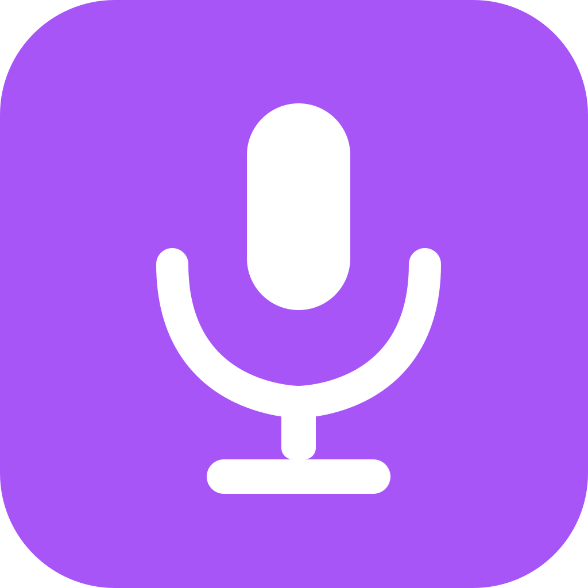
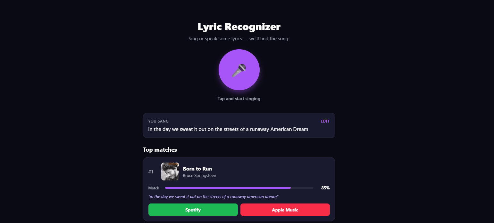

<div align="center">



# Lyric Recognizer

**Sing or speak song lyrics, get a ranked list of matches with one-tap links to Spotify and Apple Music.**

[Live demo →](https://lyric-recognizer.vercel.app/)

</div>

<p align="center">
  
</p>

## How it works

1. **Capture** — the browser's Web Speech API transcribes your voice in real time. If it mishears, you can hit **Edit** and type the lyrics manually before searching.
2. **Search** — the transcript goes to the [Genius API](https://docs.genius.com/), whose search hits actual lyric content rather than just song titles. (Without a Genius token the app falls back to [lyrics.ovh](https://lyricsovh.docs.apiary.io/), which only matches titles — so without Genius, the app only works when you sing the title phrase.)
3. **Rank** — for the top candidates we fetch the full lyrics from lyrics.ovh and score each against your transcript using a token + bigram similarity. Results are deduped by canonical (artist, title) so live and remastered variants collapse onto the studio recording, and ordered by confidence with a 0–100% match score.
4. **Listen** — every match gets an Apple Music link via the public iTunes Search API. The Spotify button uses [Authorization Code with PKCE](https://developer.spotify.com/documentation/web-api/tutorials/code-pkce-flow): on first click, you sign into your own Spotify account in a new tab; afterward the app uses your token to find and open the track.

```
voice ─▶ Web Speech API ─▶ transcript ─▶ (optional Edit)
                                              │
                                              ▼
                                  Genius /search ─▶ candidates
                                              │
                                              ▼
                              fetch lyrics + similarity score
                                              │
                                              ▼
                          ┌──────── ranked matches ────────┐
                          │                                │
                          ▼                                ▼
                Spotify Web API                  iTunes Search API
              (PKCE, user-signed-in)            (public, no auth)
```

There is **no backend**: Genius, lyrics.ovh, iTunes Search, and Spotify (with PKCE) are all CORS-friendly and can be called directly from the browser.

## Quick start

You need **Node 20+** and a Chromium-based browser or Safari (for the Web Speech API).

```bash
git clone https://github.com/pedromussi1/Lyric-Recognizer.git
cd Lyric-Recognizer
npm install
npm run web
```

Then open the URL Expo prints — but **navigate to it via `http://127.0.0.1:8081/`**, not localhost. Spotify's redirect-URI policy treats `localhost` and `127.0.0.1` as different origins and only accepts the loopback IP.

Click the microphone, sing a verse, see the matches. Apple Music and lyric matching work out of the box; Spotify and Genius are opt-in below.

## Recommended: enable Genius lyric search

Without a Genius token the app falls back to lyrics.ovh's title-only search, so it only finds songs when you happen to sing the title. Setting up Genius unlocks real lyric-content search (e.g. *"I was happy in the haze of a drunken hour"* → *Heaven Knows I'm Miserable Now*) and takes about 30 seconds.

1. Go to <https://genius.com/api-clients>, sign in or create an account.
2. Click **New API Client**. Any URL works for the website / redirect fields — Genius doesn't validate them for read-only access.
3. On the next page, click **Generate Access Token** and copy the token.
4. In `.env` at the project root (copy from `.env.example` if it doesn't exist):
   ```
   EXPO_PUBLIC_GENIUS_TOKEN=paste_your_token_here
   ```
5. Restart `npm run web`.

The token is free, read-only, and never expires.

## Optional: enable the Spotify button

The Spotify integration is opt-in. If you skip this, the Spotify button is hidden and everything else still works.

1. Register an app at <https://developer.spotify.com/dashboard>.
2. In **Settings → Redirect URIs**, add (with trailing slashes — Spotify is strict):
   - `http://127.0.0.1:8081/` (local dev)
   - `https://your-deployed-domain.com/` (when you ship)
3. Tick **Web API** as the API/SDK.
4. Copy the **Client ID** from the app's settings page (ignore the secret — PKCE doesn't need it).
5. In `.env`:
   ```
   EXPO_PUBLIC_SPOTIFY_CLIENT_ID=your_client_id_here
   ```
6. Restart `npm run web`.

When a user clicks the Spotify button for the first time, a new tab opens to Spotify's auth page. After approving, the new tab navigates itself to the song — the original tab keeps its transcript and search results intact.

## Deploying

The app is a static Expo Web export, no server. Vercel deploys with one command:

```bash
npx vercel
```

Then add `EXPO_PUBLIC_GENIUS_TOKEN` and `EXPO_PUBLIC_SPOTIFY_CLIENT_ID` in **Vercel → Project Settings → Environment Variables**, and redeploy with `npx vercel --prod`. The `vercel.json` in the repo handles the build configuration.

After deploying, add your production URL (with trailing slash) to the Spotify dashboard's redirect URIs.

## Project layout

```
.
├── App.tsx                  # main screen
├── app.json                 # Expo config
├── vercel.json              # Vercel deployment config
├── .env.example             # optional API tokens
├── scripts/
│   └── generate-icons.mjs   # regenerate the icon set from SVG
└── src/
    ├── components/
    │   ├── RecordButton.tsx
    │   └── MatchCard.tsx
    ├── services/
    │   ├── speech.ts        # Web Speech API wrapper
    │   ├── genius.ts        # Genius search (lyric-content)
    │   ├── lyricsMatcher.ts # candidate dispatch + ranking
    │   ├── spotify.ts       # PKCE OAuth + search (popup-tab flow)
    │   └── appleMusic.ts    # iTunes Search API (no auth)
    ├── utils/
    │   └── similarity.ts    # token + bigram similarity
    └── types/index.ts
```

## Roadmap

- **iOS native**: the speech step uses the browser-only Web Speech API. To run on a real iOS device we'd swap that single service for [`expo-speech-recognition`](https://docs.expo.dev/) or `@react-native-voice/voice`, and replace the PKCE redirect with [`expo-auth-session`](https://docs.expo.dev/versions/latest/sdk/auth-session/). The rest of the app is already platform-neutral.
- **Better matching**: replace the bigram similarity with embeddings (e.g. small sentence-transformer) for handling sung filler syllables and misheard words.
- **Whisper upgrade**: optional toggle to send audio to Whisper instead of Web Speech for users who care about quality more than free.
- **Inline playback**: embed the Spotify and Apple Music players directly in the app instead of opening externally.

## Tech

- [Expo](https://expo.dev/) (React Native + Web)
- TypeScript
- [Genius API](https://docs.genius.com/) — lyric-content search
- [lyrics.ovh](https://lyricsovh.docs.apiary.io/) — public lyrics text API + zero-token fallback search
- [iTunes Search API](https://developer.apple.com/library/archive/documentation/AudioVideo/Conceptual/iTuneSearchAPI/) — Apple Music links, no auth
- [Spotify Web API](https://developer.spotify.com/documentation/web-api) with [Authorization Code + PKCE](https://developer.spotify.com/documentation/web-api/tutorials/code-pkce-flow) — entirely client-side
- Web Speech API for voice capture
